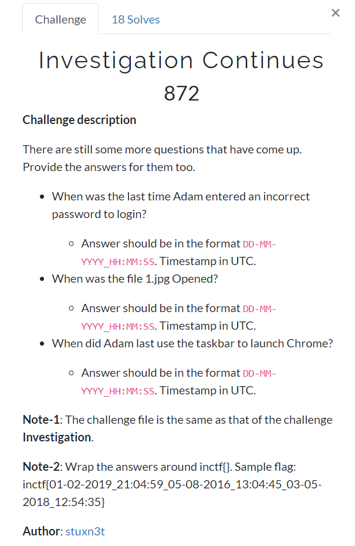
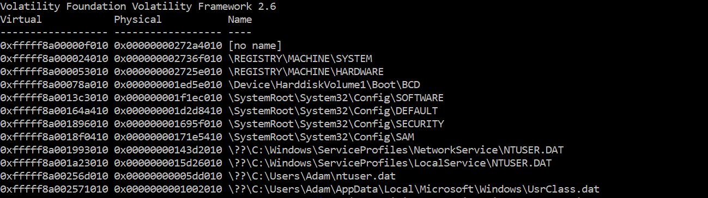
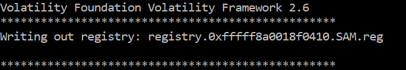
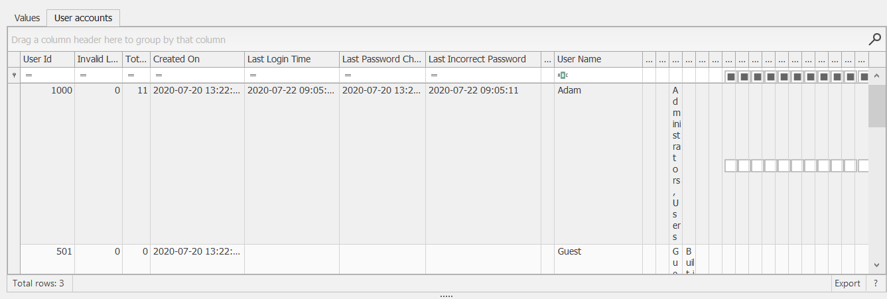
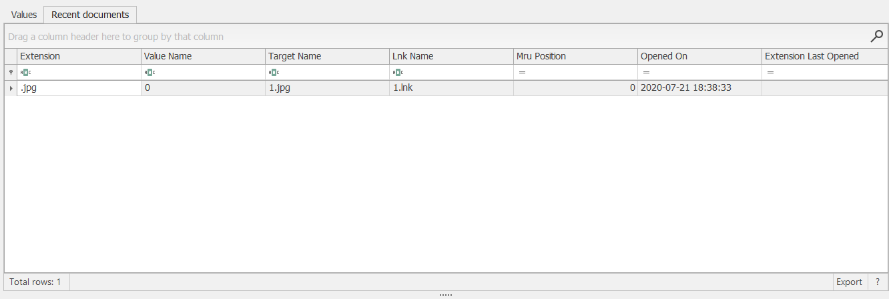
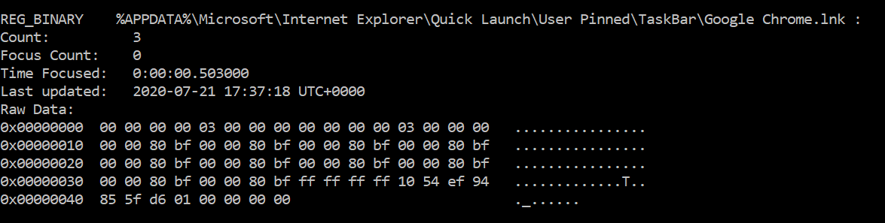

AND the Investigation continues... What have you done Adam? ( ಠ ʖ̯ ಠ)
The challenge description is as below:



**Question 1**: When was the last time Adam entered an incorrect password to login?

The `SAM` registry hive in windows will generally have the answer for this. Do we have it? Since we found out the profile in the [Investigation](insertlink) challenge. We will look at the `hivelist` directly.
```
volatility --profile=Win7SP1x64 -f windows.vmem hivelist
```


I was struck with two options - 
1. Dump the `SAM` registry and open it in Eric Zimmerman's `Registry Explorer` or,
2. list the values in the console and manually interpret the byte values to get the `filetime` of the `last invalid login`. 

But I learnt my lesson on not to trust my manual calculation abilities in the Investigation challenge, so I decided to go with option 1.

```
 volatility --profile=Win7SP1x64 -f windows.vmem dumpregistry -o 0xfffff8a0018f0410 -D=dumpdir/
```


On opening the file in `Registry Explorer`, we can find the `last invalid login` time in `SAM\Domains\Account\Users`.



Therefore, the last incorrect password was entered by Adam on `22-07-2020 09:05:11`.

**Question 2**: When was the file 1.jpg Opened?
To know about the recently used apps or files, the `RecentApps` or `RecentDocs` hives can be useful. You can also use the `mftparser` plugin to find the last used time of files.

Let's take a look at the `RecentDocs` key in the `ntuser.dat` of Adam. From the list of hives above, dump the hive named `\??\C:\Users\Adam\ntuser.dat` at the virtual offset `0xfffff8a00256d010`

```volatility --profile=Win7SP1x64 -f windows.vmem dumpregistry -o 0xfffff8a00256d010 -D dumpdir/```

On opening the `.reg` file in the Registry Explorer search for the `RecentDocs` key. The full path is `Software\Microsoft\Windows\CurrentVersion\Explorer\RecentDocs\.jpg`



The file named `1.jpg` was last opened on `21-07-2020 18:38:33`.

**Question 3**: When did Adam last use the taskbar to launch Chrome?
The `userassist` plugin  will help us find the answer to this. 

```volatility --profile=Win7SP1x64 -f windows.vmem userassist```



Adam last used the taskbar to launch Google Chrome on `21-07-2020_17:37:18`.
