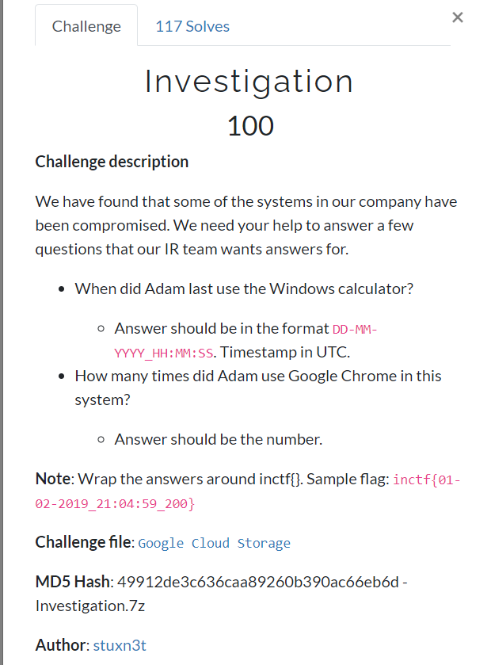
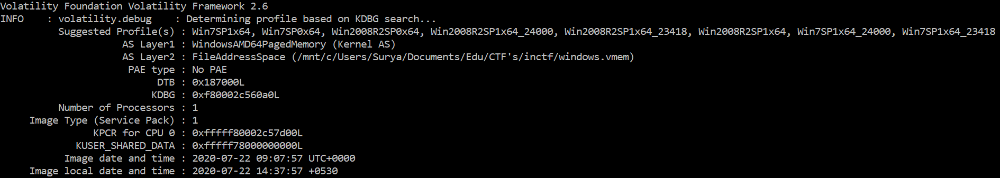
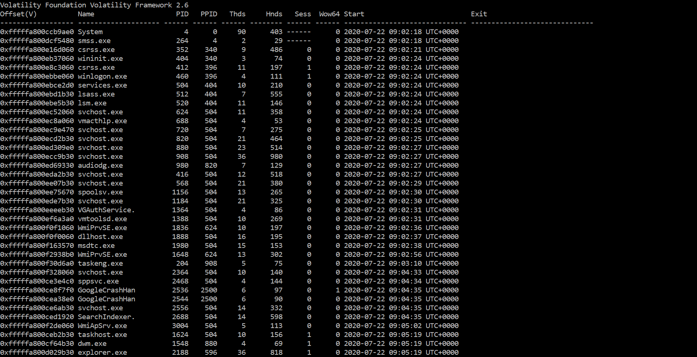
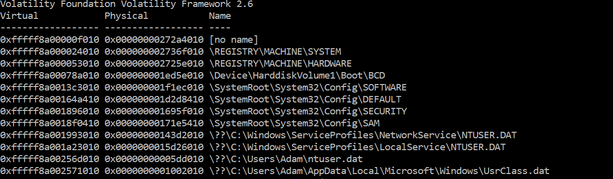
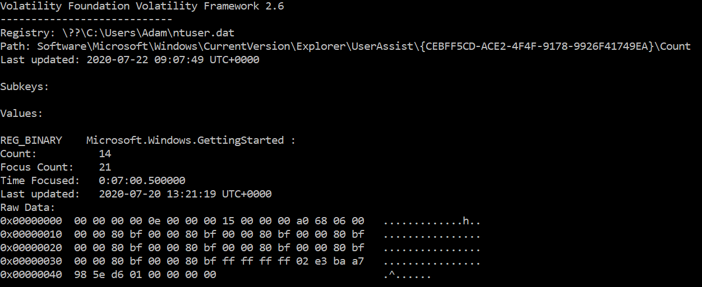
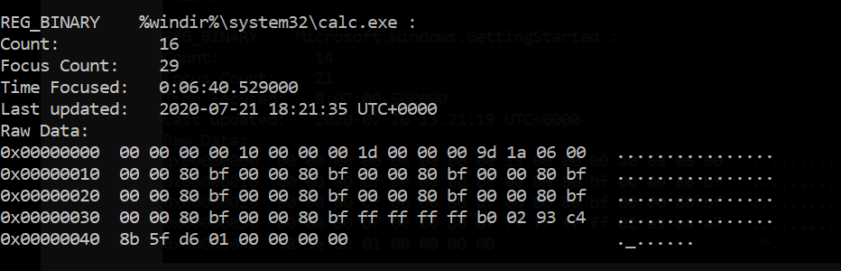
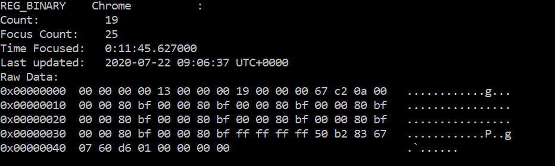

We are provided with a file name `windows.vmem` which is a Windows memory dump file.



**Step 1**: Find the profile of the memory dump using the `imageinfo` plugin
```
volatility imageinfo -f windows.vmem
```

**Step 2**: Once we get the profile, check if the calculator was running when the dump was created. This can be done using the `pslist` plugin.
```
volatility --profile=Win7SP1x64 -f windows.vmem pslist
```

Unfortunately, the `calc.exe` wasn't running. It would've been easy to get the timestamp from this output.

**Step 3**: Windows Registry!! One of the most informative and most difficult part to analyze forensically. First check the hives using `hivelist` plugin.
```
volatility --profile=Win7SP1x64 -f windows.vmem hivelist
```


We have a NTUSER.DAT for the user Adam. This is kinda a log file that contains user's settings confs etc.

**Step 4**: Take a leap of faith and analyze the UserAssist\{...}\Count registry using the `userassist` plugin in volatility3 (Use the plugin's for god's sake, I was doing it
manually and the last run time I came up with was one second later). You could also dump the `NTUSER.DAT` using `dumpregistry` and then use Eric Zimmerman's `Registry Explorer` 
to skim through it.
```
volatility --profile=Win7SP1x64 -f windows.vmem userassist
```


Locate the calc.exe and find out the last run time.


Then locate the Chrome and find the run count.


Therefore, the flag is `inctf{22-07-2020_18:21:35_19}
