The challenge was as given below:

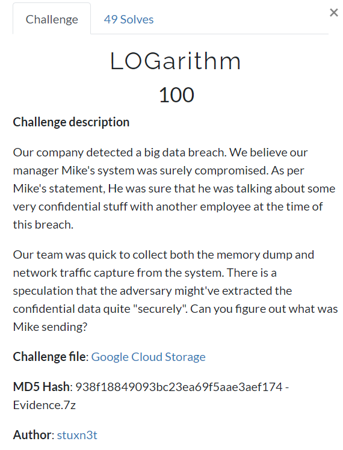


A file named `Evidence.vmem` was provided to us. While exploring it using volatility. W.L.G, scan for the profile using the `imageinfo` plugin.

I decided to use the `screenshot` plugin to see if I can stumble upon any information.
```volatility --profile=Win7SP1x64 -f Evidence/Evidence.vmem screenshot -D shots/```


One of the screenshots was as follows:

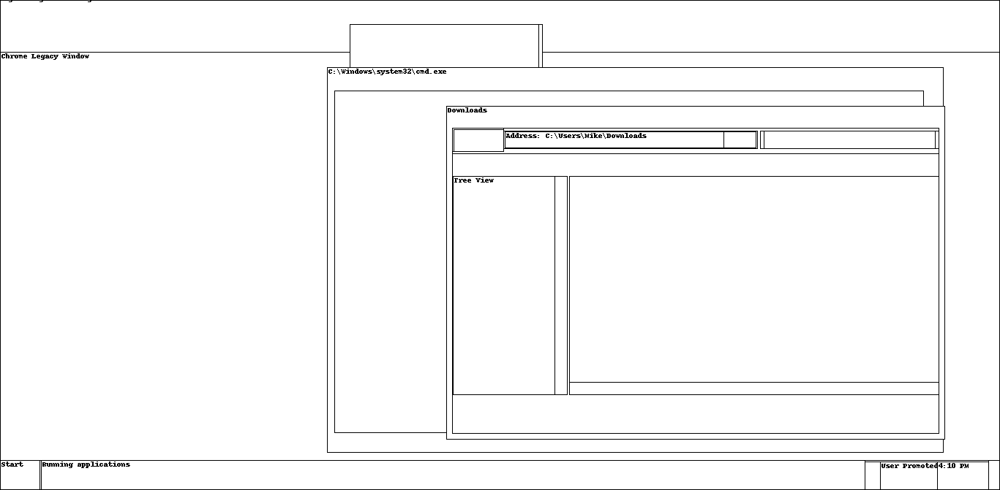

As you can see, the `cmd.exe`, `Chrome` and `Downloads` windows are open and the `Downloads` points to the `C:\Users\Mike\Downloads` directory. So, out of curiosity, I looked at his browsing history and also scanned through the files present in the above directory.

```volatility --plugins=plugins/ --profile=Win7SP1x64 -f Evidence/Evidence.vmem chromehistory```

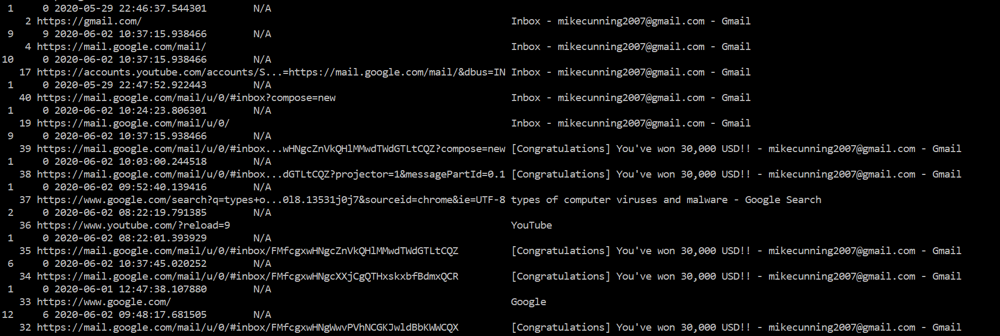

From the image you can see that Mike opened spam email

```volatility --profile=Win7SP1x64 -f Evidence/Evidence.vmem filescan | grep 'Users\Mike\Downloads'```

ANDDD 

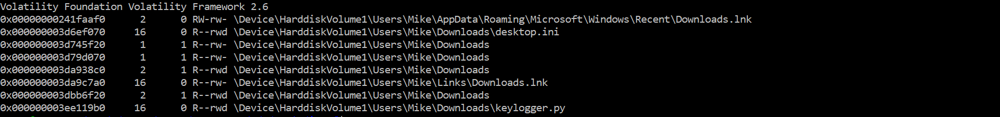

downloaded a keylogger!! We can get the physical offset from here to dump the file.

Now, dump the keylogger and look at how the keystrokes were being sent to the adversary.

```volatility --profile=Win7SP1x64 -f Evidence/Evidence.vmem dumpfiles -Q 0x000000003ee119b0 -D dumpdir/```

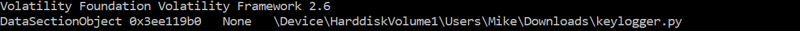

You can look at `keylogger.py`'s code [here](keylogger.py). The keystrokes were being sent to the IP address `18.140.60.203` and port `1337`.
Check the pcap file if any information was sent. The packets that were sent are:

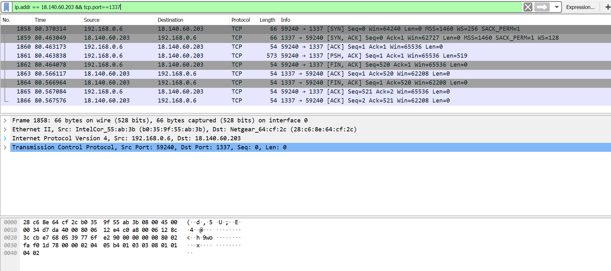

The data that was sent to the adversary can be found by following the conversation:

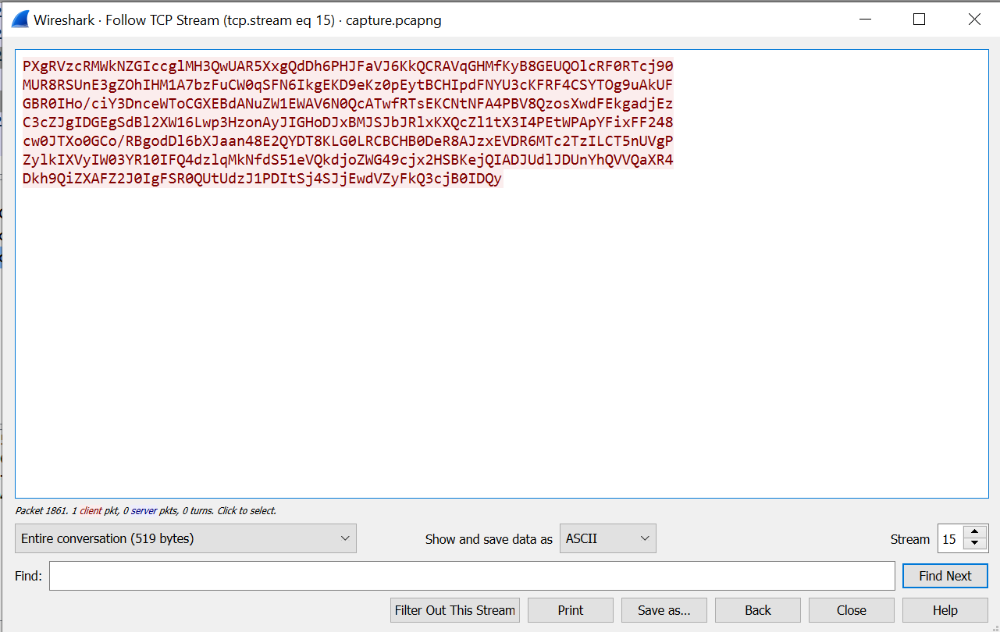

The data was encrypted before being sent to the adversary. The encryption was done in two simple operations:
1. The keystrokes were being XORed with a key that is stored as an environment variable named `t3mp`. Let's find it using the `envars` plugin.

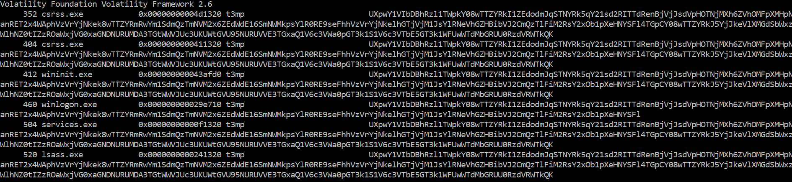

2. Then it is being encoded to base64.

Let's write a simple decrypter. Basically decode it from base64 and XOR it with the key we found above. The code can be found [here](www.github.com). Upon running it, we can get the flag.

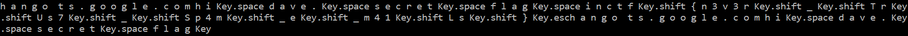

Therefore the flag is `inctf{n3v3r_TrUs7_Sp4m_e_m41Ls}`

**Another way to solve it:**

List the processes running using `pslist`.

```volatility --profile=Win7SP1x64 -f Evidence/Evidence.vmem pslist```

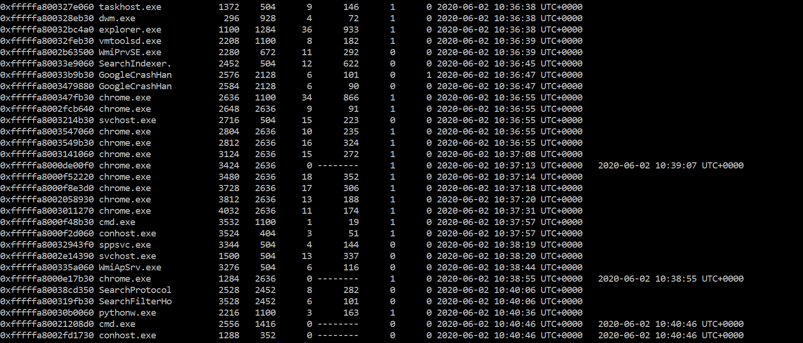

and hah!! we have pythonw.exe running. Let's take a look at what was run with the `pythonw.exe`.

```volatility --profile=Win7SP1x64 -f Evidence/Evidence.vmem cmdline -p 2216```

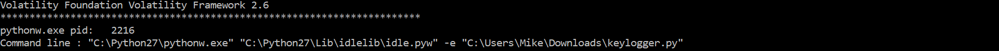

We can see the keylogger being used in the above image.
